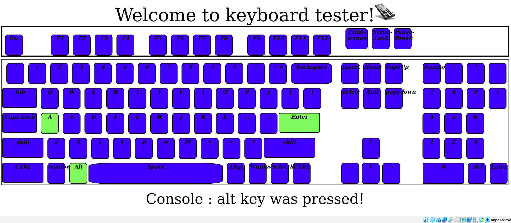

# keyboard_Tester
Test your keyboard with this program!

* Warning : Some keys may differ in some browsers.

-> This is a simple keyboard test program.  
-> You can detect brokenor not working keys on the keyboard.  
-> Some keys(F1,F2,Esc..) may need to be triggered by pressing other keys of the keyboard to see if it works.  
-> It will turn green when you press the button. 
 
 

